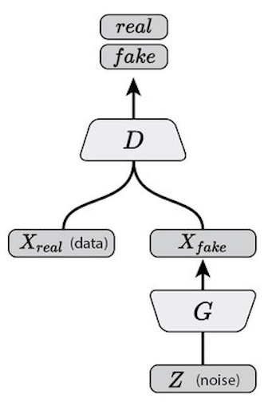
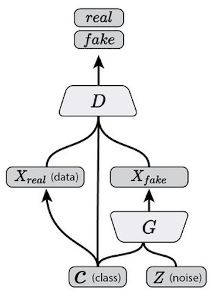
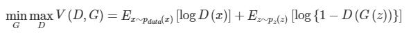
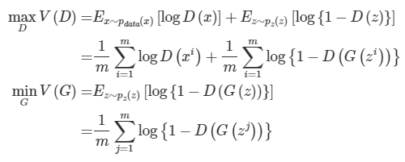

# Generative Adversarial Network

Generative Adversarial Network aims to make the generator have a distribution similar to the probability distribution of the original data by learning two neural networks hostile to each other, Generator and Discriminator.
In this repository, two GAN models have been implemented: Vanilla GAN, which generates data by the conventional method, and Conditional GAN, which creates data for a specific class more clearly by adding a One-Hot class vector as input.
The architectures of Vanilla GAN and Conditional GAN ​​are as follows, respectively.

##### Vanilla GAN Architecture


##### Conditional GAN Architecture


### Formula

The objective function of the Generative Adversarial Network is as follows:



In actual training, two networks are not trained at the same time, but are updated separately. Each objective function is as follows:



### Training Configuration

- Optimizer: RMSProp
- Learning Rate: 0.001
- Loss Function: Binary Cross Entropy
- He Initialization
- Batch Normalization
- Activation: ReLU

### Usage

#### Train
In a Generative Adversarial Network, features of data are distributed in a latent space, and a specific data point in this space is called a Latent Variable or Latent Vector. The size of this Latent Variable can be arbitrarily specified, and is passed as an argument of the class constructors of gan.py and cgan.py.

##### gan.py

```python
class GAN(tf.keras.models.Model):
    def __init__(self, input_dim, **kwargs):
        ...
```

##### cgan.py

```python
class ConditionalGAN(tf.keras.models.Model):
    def __init__(self, latent_dim, num_classes, **kwargs):
        ...
```

Then, you need to inherit the classes (GAN, ConditionalGAN) and override the get_generator and get_discriminator functions to create and return a model.

```python
import tensorflow as tf

from gan import GAN

class MnistGAN(GAN):
    def get_generator(self) -> tf.keras.models.Model:
        ...
        return tf.keras.models.Model(g_input, g_output)

    def get_discriminator(self) -> tf.keras.models.Model:
        ...
        return tf.keras.models.Model(d_input, d_output)
```

Now, you need to instantiate and train a subclass of GAN. It is no different from the existing Tensorflow training method. Just call fit method and pass x, y (for Conditional GAN ​​only), batch_size, epochs, and callbacks as parameters.

##### Training Vanilla GAN

```python
gan = MnistGAN(input_dim=100)
gan.compile(
    optimizer=tf.keras.optimizers.RMSprop(lr=1e-3, decay=3e-8),
    loss=tf.losses.binary_crossentropy)

history = gan.fit(
    x=x,
    epochs=150,
    batch_size=128)
```

##### Training Conditional GAN

```python
cgan = MnistCGAN(latent_dim, num_classes)
cgan.compile(
    optimizer=tf.optimizers.RMSprop(learning_rate=1e-3, decay=3e-8),
    loss=tf.losses.binary_crossentropy)

history = cgan.fit(
    x=x,
    y=y,            # for Conditional GAN only
    epochs=150,
    batch_size=128)
```